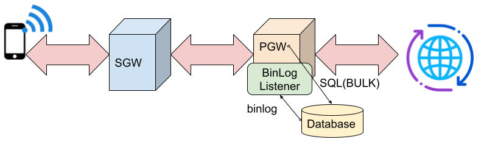
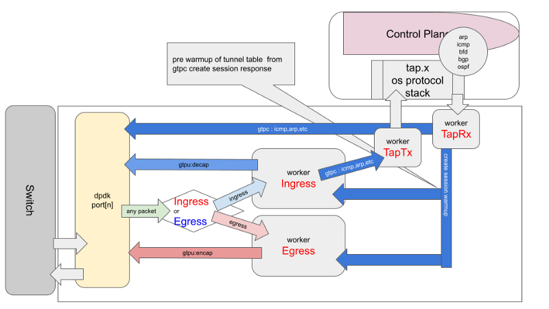
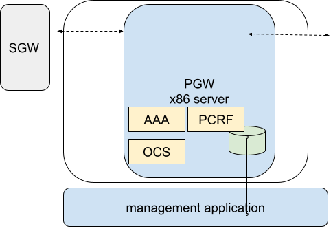

# mixi-pgw

+ [home](./README.md) <<
+ [binlog](./binlog/README.md)
+ [ctrl plane](./ctrlplane/README.md)
  + [delete bearer](./ctrlplane/src/cmd/README.md)
  + [proxy](./ctrlplane/src/proxy/README.md)
+ [data plane](./dataplane/README.md)
+ [tools](./tools/README.md)
  + [tools sources](./tools/src/README.md)
  + [radius](./tools/src/mod/mod_radius/README.md)
  + [diameter](./tools/src/mod/mod_diameter/README.md)
  + [sgw-tun](./tools/cfg/tools/sgw_tun/README.md)




## introduction

mixi-pgw is Packet Data Network Gateway implementation(open source 4G/ 3GPP)

+ mixi-pgw includes AAA, PCRF, OCS
+ suitable for dpdk platform
+ Use mysql for database




## directory structure layout

```
├── binlog                      // binlog client(sample)
├── ctrlplane                   // control plane
│   ├── inc
│   ├── src
│   └── test
├── dataplane                   // data plane
│   ├── inc                     // include headers, for data plane
│   ├── src
│   └── test
├── deps                        // work directory for dependencies
└── tools
    ├── cfg                     // config files
    │   ├── ddl                 // ddls
    │   └── tools
    ├── inc
    │   ├── lib                 // include headers, library mixi-pgw-misc
    │   ├── lib_db              // include headers, library mixi-pgw-db
    │   ├── lib_lookup          // include headers, library mixi-pgw-lookup
    │   └── lib_srv             // include headers, library mixi-pgw-srv
    ├── src
    │   ├── lib                 // library mixi-pgw-misc
    │   ├── lib_db              // library mixi-pgw-db
    │   ├── lib_lookup          // library mixi-pgw-lookup
    │   ├── lib_srv             // library mixi-pgw-srv
    │   └── mod
    │       ├── mod_diameter    // mixi-pgw-diameter, policy module
    │       ├── mod_radius      // mixi-pgw-radius, authentication module
    │       └── mod_sgw         // mixi-pgw-sgw, SGW simulator
    └── test
        └── strs
```




## dependencies

Download and setup mysql-8.x with boost from following URL.

https://dev.mysql.com/downloads/

```
├── deps                    // dependencies
│   ├── mysql-8.0.28
```

```
tar zxvf mysql-boost-8.0.28.tar.gz
cd ./mysql-8.0.28
mkdir -p ./_build
cd ./_build
cmake .. -DDOWNLOAD_BOOST=1 -DWITH_BOOST=./
make
```

### with custom openssl

```
cmake .. -DDOWNLOAD_BOOST=1 -DWITH_BOOST=./ -DWITH_SSL=/usr/local/opt/openssl@1.1
```


### dpdk

```
apt-get install dpdk  dpdk-dev dpdk-doc libdpdk-dev
apt-get install dpdk dpdk-igb-uio-dkms
apt-get install libnuma-dev
```

### hugepages

```
sysctl -w vm.nr_hugepages=1024
```
+ /etc/default/grub

```
GRUB_CMDLINE_LINUX="crashkernel=auto rhgb quiet default_hugepagesz=1G hugepagesz=1G hugepages=16 iommu=pt intel_iommu=on"
```

```
update-grub
mkdir /mnt/huge1G
```

+ /etc/fstab

```
nodev /mnt/huge1G hugetlbfs pagesize=1GB 0 0
```

+ /etc/modules

```
igb_uio
```

> reboot


## database setup

Prepare replication master database as follows.

```
docker pull mysql
docker run --name mysql -e MYSQL_ROOT_PASSWORD=develop -d -p 3306:3306 mysql
docker exec -it mysql bash

mysql -u root -p

mysql> CREATE DATABASE mixi_pgw;
mysql> CREATE USER 'root'@'127.0.0.1' IDENTIFIED BY 'develop'
mysql> use mixi_pgw;
```

### mixi_pgw database connection

```
$ ./mysql -u root -p -h 127.0.0.1 mixi_pgw
```


## generate Table,Procedures

|no| ddl |
|---|---|
|1|./tools/cfg/ddl/diameter_proc.sql|
|2|./tools/cfg/ddl/diameter.sql|
|3|./tools/cfg/ddl/ocs.sql|
|4|./tools/cfg/ddl/policy.sql|
|5|./tools/cfg/ddl/proc.sql|
|6|./tools/cfg/ddl/radius.sql|


### setup replication

```
mysql> GRANT ALL ON *.* TO 'root'@'%';
mysql> GRANT ALL ON *.* TO 'root'@'127.0.0.1';
mysql> GRANT REPLICATION SLAVE ON *.* TO root@'%';
mysql> GRANT REPLICATION SLAVE ON *.* TO root@'127.0.0.1';
mysql> GRANT REPLICATION CLIENT ON *.* TO root@'%';
mysql> GRANT REPLICATION CLIENT ON *.* TO root@'127.0.0.1';
```

```
mysql> SHOW MASTER STATUS;
+---------------+----------+--------------+------------------+-------------------+
| File          | Position | Binlog_Do_DB | Binlog_Ignore_DB | Executed_Gtid_Set |
+---------------+----------+--------------+------------------+-------------------+
| binlog.000002 |     2290 |              |                  |                   |
+---------------+----------+--------------+------------------+-------------------+
```

```
mysql> SHOW VARIABLES LIKE '%SERVER_ID%';
+----------------+-------+
| Variable_name  | Value |
+----------------+-------+
| server_id      | 1     |
| server_id_bits | 32    |
+----------------+-------+
```

### Simple check with Replication Client

```
$./mysqlbinlog --read-from-remote-server --host=127.0.0.1 --user=root --password --stop-never -vv --base64-output=AUTO binlog.000002
```
