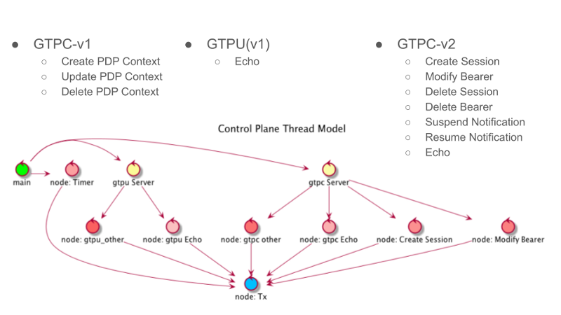

# mixi_pgw_ctrl_plane

+ [home](../README.md)
+ [binlog](../binlog/README.md)
+ [ctrl plane](../ctrlplane/README.md) <<
  + [delete bearer](../ctrlplane/src/cmd/README.md)
  + [proxy](../ctrlplane/src/proxy/README.md)
+ [data plane](../dataplane/README.md)
+ [tools](../tools/README.md)
  + [tools sources](../tools/src/README.md)
  + [radius](../tools/src/mod/mod_radius/README.md)
  + [diameter](../tools/src/mod/mod_diameter/README.md)
  + [sgw-tun](../tools/cfg/tools/sgw_tun/README.md)

## introduction

mixi_pgw_ctrl_plane is Control Plane implementation with independent design
  for GTP-C/control and GTP-U/data processing.



## functions

+ GTPv1 Create/Update/Delete PDP Context Request
+ GTPv2 Create/Delete Session Request
+ GTPv2 Modify/Delete Bearer Request
+ GTPv2 Resume/Suspend Notification Request

## Dependency

+ googletest
+ libevent
+ included Berkeley queue.h

```
apt-get install libevent-dev
apt-get install libgtest-dev
```

## Compile/Link

```
mkdir ./_build/
cd ./_build
cmake ..
make
```
