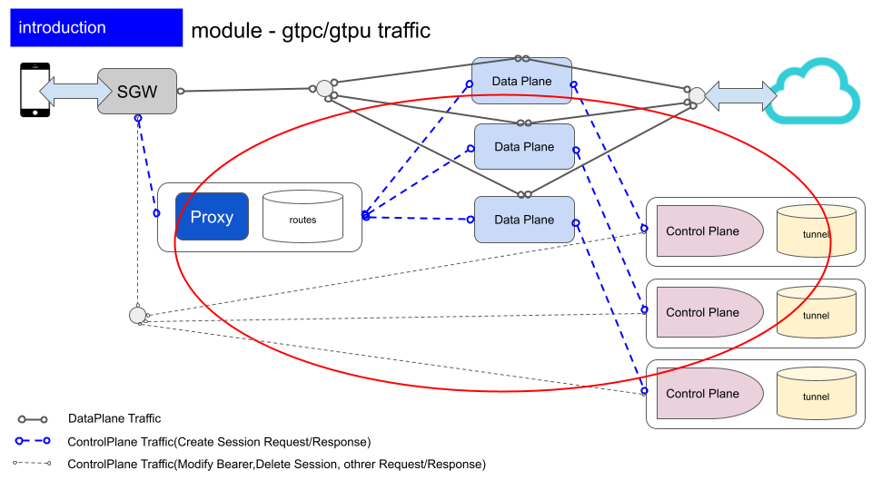
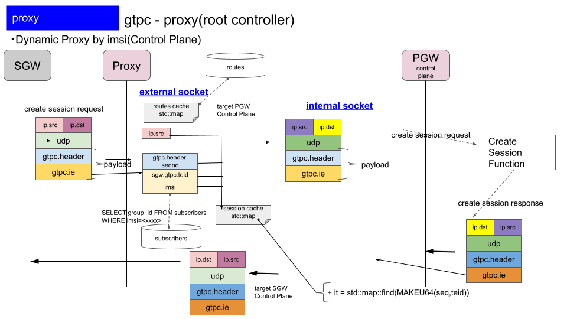
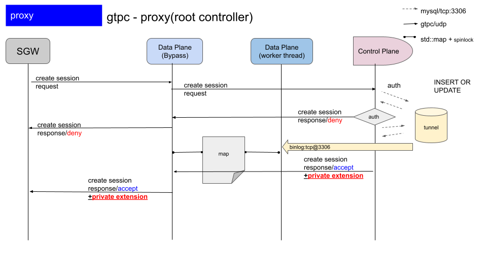

# mixi_pgw_ctrl_plane_proxy


+ [home](../../../README.md)
+ [binlog](../../../binlog/README.md)
+ [ctrl plane](../../../ctrlplane/README.md)
  + [delete bearer](../../../ctrlplane/src/cmd/README.md)
  + [proxy](../../../ctrlplane/src/proxy/README.md) <<
+ [data plane](../../../dataplane/README.md)
+ [tools](../../../tools/README.md)
  + [tools sources](../../../tools/src/README.md)
  + [radius](../../../tools/src/mod/mod_radius/README.md)
  + [diameter](../../../tools/src/mod/mod_diameter/README.md)
  + [sgw-tun](../../../tools/cfg/tools/sgw_tun/README.md)

## introduction

mixi-pgw-ctrl-plane-proxy is layer4-based GTPU/GTPC LoadBalancer,
    that is Hight Availability in Distributed System.

+ Classification Load Balancing
  + docomo
  + softbank
  + au
  + Developer(for testing)
  + QA Team
  + Company

## functions

+ Load balancing for GTPC/U packet




## nested controller




## packet sequence




## Dependency

+ googletest
+ libevent

```
apt-get install libevent-dev
apt-get install libgtest-dev
```

## Compile/Link

```
mkdir ./_build/
cd ./_build
cmake ..
make
```
