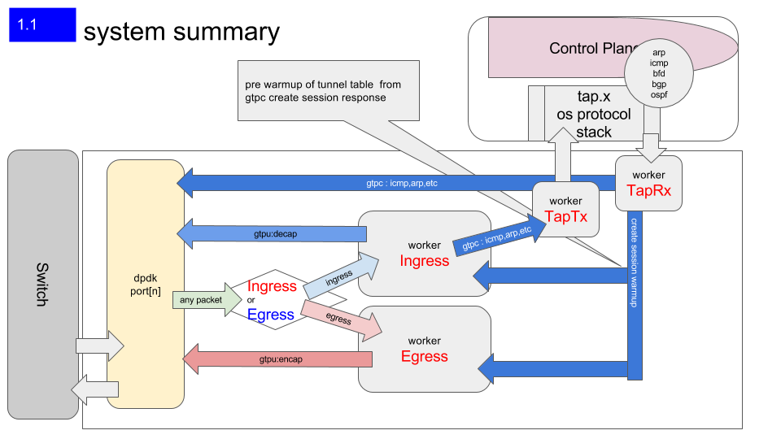
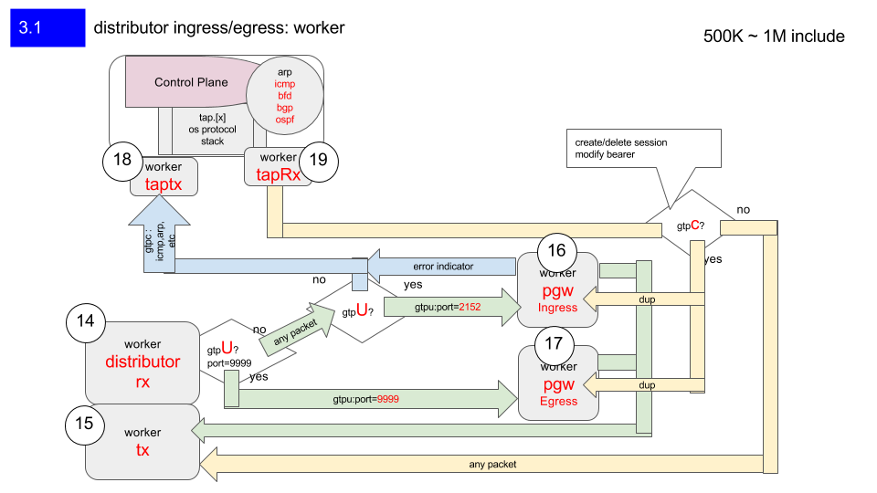
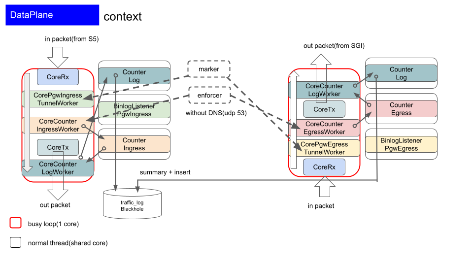

# mixi_pgw_data_plane

PGW data plane / on dpdk framework

+ [home](../README.md)
+ [binlog](../binlog/README.md)
+ [ctrl plane](../ctrlplane/README.md)
  + [delete bearer](../ctrlplane/src/cmd/README.md)
  + [proxy](../ctrlplane/src/proxy/README.md)
+ [data plane](../dataplane/README.md) <<
+ [tools](../tools/README.md)
  + [tools sources](../tools/src/README.md)
  + [radius](../tools/src/mod/mod_radius/README.md)
  + [diameter](../tools/src/mod/mod_diameter/README.md)
  + [sgw-tun](../tools/cfg/tools/sgw_tun/README.md)

## introduction

mixi_pgw_data_plane is Data Plane implementation with independent design
  for GTP-C/control and GTP-U/data processing.
  (Encapsulation and Decapsulation processes of GTPU/GTPC packets require very low latency.)

## what's dpdk

DPDK(Data plane development kit) is a framework (under linux)
for control NIC consists of user-land libraries and drivers
for fast packet processing.

features of adopting DPDK framework for PGW

+ PMD (pull mode driver) is polling based receiving mechanism.(includes 1, 10,and 40 Gb)
+ dpdk software ring will not produce as many cache misses as in linked queue.
  + with linux hugepages

## application on dpdk, important notes

> To avoid any un-necessary interrupt processing overhead, the execution environment must not use any
asynchronous notification mechanisms.

> Whenever needed and appropriate, asynchronous communication should be introduced as much as posibble through the use of rings.

> Avoiding lock contention is a key issue in a many-core environment.

> To address this issue, PMDs are designed to work with per-core private resourcees as much as possible.

> To comply with Non-Uniform Memory Access(NUMA), memory management is designed to assign to each logical core a private buffer pool in local memory to minimize remote memory access.

> To achieve optimal performance, overall software design choices and pure software optimization techniques must be considered and balanced against available low-level hardware-based optimizations features(CPU cache, Bus speed, NIC PCI bandwidth, and so on).


## PGW strategies



## PGW inside



## User fairness Control




## directory structure layout

```
.
└── dataplane         // data plane root directory
    ├── img           //  images
    ├── inc           //  include headers, for data plane modules.
    ├── src           //  source files
    │   ├── accm      //    accumulator, aggregate traffic
    │   ├── app       //    application  implements
    │   ├── arch      //    architecture defined
    │   ├── conf      //    configuration
    │   └── core      //    core implements
    └── test          //  for test
        ├── pkts
        └── script
```

## before testing

```
mysql> RESET MASTER;
```

## test status

```
[o] = okay
[M] = modify -> test okay. 
[ ] = failed.

- [o] ./test/t_encap
- [o] ./test/t_gtpu2gre
- [o] ./test/t_greterm
- [o] ./test/t_counter
- [M] ./test/t_counter_full_1ring
- [M] ./test/t_counter_enough_map
    - TRANSFER_RING_BURST definition value(128 -> 64) change was affecting test failed.
- [o] ./test/t_counter_rotate
- [o] ./test/t_transfer
- [o] ./test/t_counter_to_transfer
- [M] ./test/t_pgw_ingress
   - DDL(not support length of column >= VARCHAR(256))
- [M] ./test/t_rx_distributor
- [M] ./test/t_pgw_ingress_dist
- [M] ./test/t_rx_distributor
- [M] ./test/t_pgw_egress_dist
- [ ] ./test/t_perf
- [ ] ./test/t_warmup
```