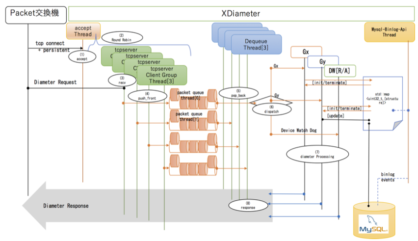
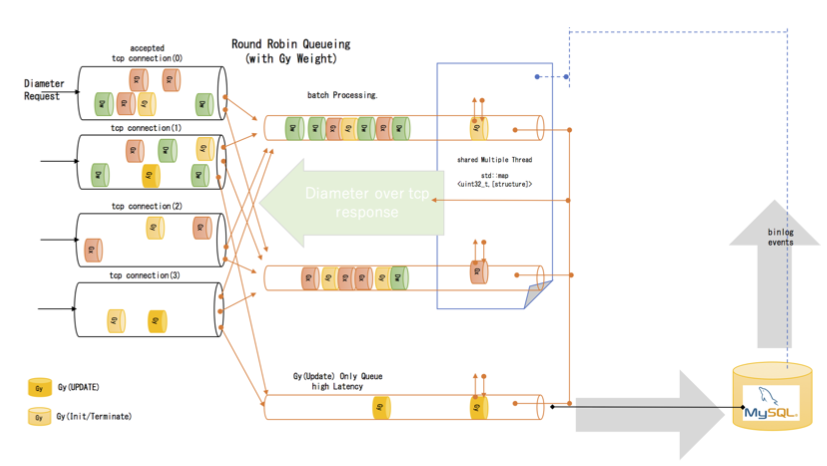

mixi-pgw-diameter
====

+ [home](../../../../README.md)
+ [binlog](../../../../binlog/README.md)
+ [ctrl plane](../../../../ctrlplane/README.md)
  + [delete bearer](../../../../ctrlplane/src/cmd/README.md)
  + [proxy](../../../../ctrlplane/src/proxy/README.md)
+ [data plane](../../../../dataplane/README.md)
+ [tools](../../../../tools/README.md)
  + [tools sources](../../../../tools/src/README.md)
  + [radius](../../../../tools/src/mod/mod_radius/README.md)
  + [diameter](../../../../tools/src/mod/mod_diameter/README.md) <<
  + [sgw-tun](../../../../tools/cfg/tools/sgw_tun/README.md)

mixi-pgw-diameter is simple and fast diameter server,
and that uses mysql as database and supports only Gx/Gy protocols.

## Introduction

mixi-pgw-diameter is characterized by reverse data flow from typical application data flow,
collecting data needed for logic.




## distributed priority queue




## Requirement

+ libevent
  + apt-get install libevent-dev
+ opensssl
  + sudo apt-get install libssl-dev


## Usage

```
git clone ..... hoge
cd hoge
mkdir ./build
cd ./build
cmake ../
make
```
