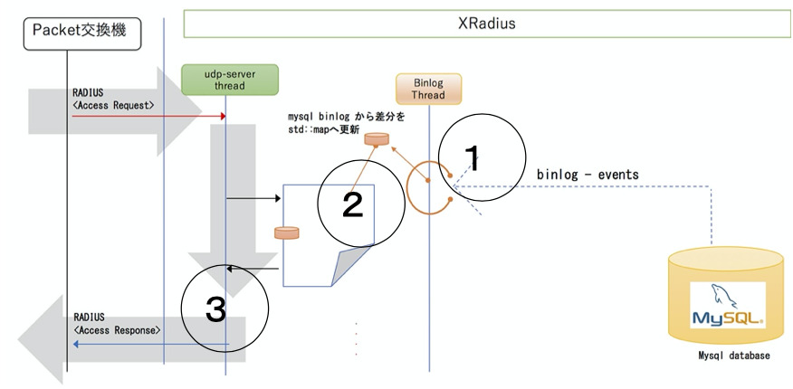

mixi-pgw-radius
====

+ [home](../../../../README.md)
+ [binlog](../../../../binlog/README.md)
+ [ctrl plane](../../../../ctrlplane/README.md)
  + [delete bearer](../../../../ctrlplane/src/cmd/README.md)
  + [proxy](../../../../ctrlplane/src/proxy/README.md)
+ [data plane](../../../../dataplane/README.md)
+ [tools](../../../../tools/README.md)
  + [tools sources](../../../../tools/src/README.md)
  + [radius](../../../../tools/src/mod/mod_radius/README.md) <<
  + [diameter](../../../../tools/src/mod/mod_diameter/README.md)
  + [sgw-tun](../../../../tools/cfg/tools/sgw_tun/README.md)

## introduction

mixi-pgw-radius is simple and fast radius server,
and that uses mysql as database, designed specifically for radius authentication that
responds only to following protocols.(server-side authentication+server-side ip address assign)

* response to RADIUS<Access-Request>
  * Calling-Station-Id(caller), ip address payout from Nas-Ip-Address(incoming device ip address).
* response to RADIUS<Accounting-Request(Start/Stop)>

## Characteristic

+ customizefull
  + mixi-pgw-radius is implemented only requied functions from RFC 2865/3162
+ simple
  + simple implementation with libevent + std::map + mysql-binlog interface
  + Implemented by 9 files , less than 1 Kstep(830 step) soruce code 
+ fast
  + 120 - 800Kpps
  + 800 Kpps is reached with 1 CPU core.
  + Assuming assigned to 14 cores, up to 800 Kpps x 14 = 11.2 M pps

## Introduction

data flow of mixi-pgw-radius is characterized that opposite of data flow of typical application.
(collecting data required for logic)




## Requirement

+ libevent
  + apt-get install libevent-dev
+ opensssl
  + sudo apt-get install libssl-dev
+ mysql-connector-c-6.1.10-src
+ mysql-binary-log-events-1.0.2-labs


## Usage

```
git clone ..... hoge
cd hoge
mkdir ./build
cd ./build
cmake ../
make
```
